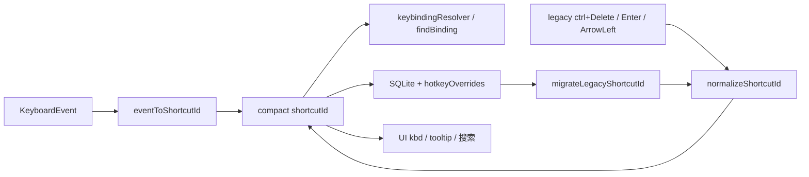

# 快捷键 Compact 语义全面迁移计划

**基线**：2026-06-14  
**范围**：shortcutId 语义层、默认绑定、override/SQLite 迁移、UI 展示、测试与文档  
**状态**：已实施并完成复核（2026-06-14）  
**用户决策**：**全面切换** — SQLite / `hotkeyOverrides` / 默认绑定声明均改为 compact 存储，并提供旧格式迁移。

---

## 一、Compact 格式规范（新建权威说明）

在 [`vibe/specs/260613-SettingUiModify/260614-shortcut-compact-semantics.md`](vibe/specs/260613-SettingUiModify/260614-shortcut-compact-semantics.md) 定义（项目内此前无 `cr`/`c|s|a` 成文 spec，需新建）：

### 1.1 语法

**分段规则（用户补充）**：凡组合键（修饰键 + 主键，或多修饰键），**段与段之间必须用 `-` 连接**；单键无修饰时可不含 `-`。

| 规则 | 含义 | 示例 |
|------|------|------|
| 分段符 `-` | 修饰段与主键段、修饰段彼此之间均用 `-` | `c-f`、`c-s-d`、`c-s-del` |
| 段 `c` | Ctrl（Win/Linux）/ Command（macOS） | `c-f` = Ctrl/Cmd+F |
| 段 `s` | Shift | `s-del` = Shift+Delete |
| 段 `a` | Alt / Option | `a-u` = Alt+U |
| 修饰段顺序 | 固定 `c` → `s` → `a`，各最多 1 段 | `c-s-d` = Ctrl+Shift+D |
| 键 token `cr` | Enter（单键时为整串 `cr`） | `c-cr` = Ctrl+Enter |
| 键 token `del` / `backspace` | Delete / Backspace（短 token） | `del`、`c-s-backspace` |
| 键 token `left` / `right` | ArrowLeft / ArrowRight | `left`、`c-right` |
| 键 token `f1`–`f12` | 功能键（**存储小写**；展示为 F1–F12） | `f2`、`s-f2`、`c-s-f10` |
| 键 token `space` / `tab` | Space / Tab（**固定按键**，见 §1.6） | `space`、`tab`、`s-tab`、`c-tab` |
| 单字符主键 | 小写字母/数字，作为末段 | `c-f`、`c-1` |
| 仅修饰键 | 只有修饰段、无主键段 | `c`、`s`、`c-s` |

**解析约定**：按 `-` split 后，从左到右识别修饰段（`c`/`s`/`a`），**最后一段为主键 token**；单段且无 `-` 时整串为主键（如 `cr`、`del`、`left`）。

**歧义消除**：
- Enter：`cr`（单段）；Ctrl+Enter：`c-cr`；Ctrl+R：`c-r`（单测覆盖 `cr` vs `c-r`）。
- 功能键：legacy `F2` / `shift+F2` → compact `f2` / `s-f2`（**禁止** `F2`、`s-F2` 作为存储 id；展示层可输出 `F2`、`Shift+F2`）。
- 解析时末段 `f2` 与单字符 `f`+`2` 不混淆：`f2` 为 **reserved 功能键 token**，优先于拆成 `f`+`2`。

### 1.2 通用语义扩展（覆盖 [`hotkeyBindings.js`](../../../src/global/hotkeyBindings.js:1) 全量特殊键）

在规范中补充：`up`/`down`/`esc`/`space`/`tab`/`pageup`/`pagedown`/`f1`–`f12`。

**项目内现绑定示例**（[`hotkeyBindings.js`](../../../src/global/hotkeyBindings.js:1)）：

| legacy | compact | 用途 |
|--------|---------|------|
| `F2` | `f2` | 别名/标签编辑 |
| `shift+F2` | `s-f2` | 查看全部 / 组合编辑 |

其余 `F1`–`F12`、带修饰组合均按同一规则：`{c?}-{s?}-{a?}-{fN}`，如 `c-f5`、`a-f9`。

**Tab / Space legacy → compact**（[`hotkeyBindings.js`](../../../src/global/hotkeyBindings.js:1)）：

| legacy | compact | 用途 |
|--------|---------|------|
| `Tab` | `tab` | 主界面/清除对话框/标签编辑 Tab 切换 |
| `shift+Tab` | `s-tab` | 反向 Tab |
| `ctrl+Tab` | `c-tab` | 收藏子 tab 下一个 |
| `ctrl+shift+Tab` | `c-s-tab` | 收藏子 tab 上一个 |
| `Space` | `space` | 多选 / 置顶组合编辑 |

### 1.6 固定按键：`space` / `tab`（用户补充）

与 Esc / Enter / ←→ 同级：**不允许改绑、不允许录入、不允许 override 修改**。

**策略（两层）**：

1. **录入硬阻断**：改键弹窗录制或 ✅ 时，若 normalize 后 shortcutId 的**主键 token** 为 `tab` 或 `space`，一律拒绝（toast），含 `tab`、`s-tab`、`c-tab`、`c-s-tab`、`space`。
2. **场景化保留 + 不可 override**：在 [`shortcutReservations.js`](../../../src/global/shortcutReservations.js:1) 为现有系统 binding 补全 reservation 行（commandId + when + description）；设置页命令列表对命中 command **隐藏或禁用「改键」**，override 保存路径拒绝写入 tab/space 族 id。

**须覆盖的系统 binding**（compact 化后 id）：

- `tab` / `s-tab` → `main.tab.*`、`clear-dialog` Tab、`tag.edit.focus.next` 等
- `c-tab` / `c-s-tab` → `main.collectSubTab.*`
- `space` → `list.multi.toggleCurrent`、`pin.group.edit.toggleSelect`

**固定按键说明 UI**：设置页 ⌨ popover / 改键弹窗保留规则表增加 `tab`、`space` 及 Tab 族组合说明；[`260613-zz-raw-settingUiModify.md`](vibe/specs/260613-SettingUiModify/260613-zz-raw-settingUiModify.md) §16 列表同步。

**实现辅助**（[`shortcutKey.js`](../../../src/global/shortcutKey.js:1) 或 reservations）：

- `getShortcutMainKeyToken(compactId)` → `tab` | `space` | …
- `isFixedMainKeyToken(token)` → `token === 'tab' || token === 'space'`
- `isShortcutIdFixedNonConfigurable(compactId)` → 主键 token 为 tab/space 即 true

### 1.3 跨系统展示

- **存储与匹配**：统一 compact 字符串（如 `c-f`、`c-s-del`）。
- **展示**：`formatShortcutDisplay()` 将前缀 `c`/`a` 按平台映射为 Ctrl/Command、Alt/Option；键 token 保持可读（`cr`→Enter、`f2`→F2、`s-f2`→Shift+F2 等）。
- **Mac meta**：[`hotkeyRegistry.js`](../../../src/global/hotkeyRegistry.js:1) 现有 `shortcutIdForLookup` 逻辑保留 — meta 键录制结果归并到 `c` 前缀。

### 1.4 与旧 canonical 的关系

- **唯一权威 id**：compact（全面迁移后不再写入 legacy 形态）。
- **兼容读**：`normalizeShortcutId()` 识别 legacy 输入并输出 compact（供迁移与用户旧数据）。

### 1.5 文档与文案中的引用规范（防歧义）

说明文档、spec、合约、用户向 README **不得**混用多种键位写法。统一规则：

| 场景 | 写法 | 示例 |
|------|------|------|
| 指存储/配置 id | 仅 compact | `c-s-del`、`cr`、`left` |
| 指用户可读说明 | compact + 跨平台展示（括号或表格） | `c-f`（Win：Ctrl+F / Mac：⌘F） |
| 禁止 | legacy `ctrl+shift+Delete`、`Enter`、`ArrowLeft` 单独作为 id 示例 | — |
| 禁止 | 大写功能键 id `F2`、`s-F2`；存储须 `f2`、`s-f2` | — |
| 禁止 | 无 `-` 拼接 `cf`、`csd`、`ccr` | — |
| 禁止 | 未分段的 `c cr`、易与 `c-cr` 混淆的写法 | — |

**Enter 特例**：正文描述 Enter 行为时可写「Enter」，但若出现**可配置的 shortcutId 示例**，必须用 `cr` / `c-cr`，并避免与 `c-r` 并列时不加说明。

---

## 二、代码实现路径

### 2.1 语义核心 — [`src/global/shortcutKey.js`](../../../src/global/shortcutKey.js:1)

在现有文件内扩展（不拆文件，避免 import 面过大）：

- `SPECIAL_KEY_TOKENS` / `LEGACY_TO_COMPACT` / `COMPACT_TO_LEGACY`（legacy 仅用于迁移与测试对照）
- `parseCompactShortcutId(input)` — 按 `-` 分段；修饰段 c/s/a + 末段主键 token（单段无 `-` 时整串为主键；`cr`/`c-r` 歧义由分段规则天然区分）
- `legacyToCompactShortcutId(legacy)` — 将 `ctrl+shift+Delete`、`Enter`、`ArrowLeft` 等转为 compact
- 重写 **`normalizeShortcutId`**：任意输入 → compact 输出
- 重写 **`eventToShortcutId`**：事件 → compact（Alt+字母仍用 `code` 还原，与现逻辑一致）
- 重写 **`formatShortcutDisplay`**：compact → 平台感知展示（替代当前 `ctrl+` 字符串拆分逻辑）
- 更新 **`formatShortcutTextForPlatform`**：替换描述文本中的 legacy 键位片段

### 2.2 录制层 — [`src/global/shortcutRecorder.js`](../../../src/global/shortcutRecorder.js:1)

- 删除重复 `KEY_ALIAS`/`CODE_ALIAS`，统一委托 `shortcutKey.js`
- `eventLikeToShortcutId` 输出 compact

### 2.3 默认绑定 — [`src/global/hotkeyBindings.js`](../../../src/global/hotkeyBindings.js:1)

- 约 **143** 处 `shortcutId` 改为 compact（如 `ArrowUp`→`up`，`ctrl+f`→`c-f`，`F2`→`f2`，`shift+F2`→`s-f2`，`shift+Delete`→`s-del`）
- `bindingKey()` 中嵌入的 defaultShortcutId 随声明同步变更
- 注释更新为 compact 示例

### 2.4 保留规则与固定按键 — [`src/global/shortcutReservations.js`](../../../src/global/shortcutReservations.js:1)

- `SHORTCUT_RESERVATION_RULES` 与 `MODIFIER_SHORTCUTS` 全部改为 compact
- **新增 Tab/Space 族 reservation 行**（§1.6 表格），覆盖 main-tab、collect-sub-tab、list-space、pin-group Space、clear-dialog Tab 等
- **`isShortcutAssignable` / `isRecordableShortcutId`**：主键 token 为 `tab` 或 `space` 时直接 `{ allowed: false, reason: 'fixed-key' }`（录入硬阻断）
- **Setting 命令行**：对 defaultShortcutIds 含 tab/space 族的 command，改键入口禁用或只读展示默认键
- `NON_CONFIGURABLE_SHORTCUT_IDS` deprecated 列表增加 `tab`、`space`（及文档列出的 Tab 族示例）

### 2.5 持久化迁移

| 文件 | 改动 |
|------|------|
| [`src/global/shortcutOverrides.js`](../../../src/global/shortcutOverrides.js:1) | `normalizeShortcutOverrides` 递归 normalize 所有 `shortcutId`/`shortcutIds` |
| [`src/global/commandKeybindings.js`](../../../src/global/commandKeybindings.js:1) | `dedupeShortcutIds` / `normalizeOverrideValueShape` 经 compact normalize |
| [`src/storage/shortcutKeybindingRepository.js`](../../../src/storage/shortcutKeybindingRepository.js:1) | `buildShortcutOverrideRows` / `shortcutOverrideRowsToMap` / snapshot 读写走 compact；`migrateOverridesFromSetting` 增加 legacy→compact；必要时 bump `shortcut_override_migration_hash` 触发重迁移 |
| [`src/global/shortcutStore.js`](../../../src/global/shortcutStore.js:1) | load/save 路径确保 normalize 已执行 |

### 2.6 UI 与文案

| 文件 | 改动 |
|------|------|
| [`src/views/Setting.vue`](../../../src/views/Setting.vue:1) | 改键弹窗/保留规则表/帮助文案引用 compact 规范；示例 `ctrl+d`→`c-d` |
| [`src/views/Main.vue`](../../../src/views/Main.vue:1) | tooltip 中 legacy 入参改为 compact（如 `s-del`） |
| [`src/global/hotkeyLabels.js`](../../../src/global/hotkeyLabels.js:1) | `FEATURE_LABELS` 内嵌键位改为 compact 或经 `formatShortcutTextForPlatform` 展示 |
| [`src/cpns/TagSearchModal.vue`](../../../src/cpns/TagSearchModal.vue:1) / [`TagEditModal.vue`](../../../src/cpns/TagEditModal.vue:1) / [`HotkeyTreeViewShortcut.vue`](../../../src/cpns/HotkeyTreeViewShortcut.vue:1) / [`PinGroupEditor.vue`](../../../src/cpns/PinGroupEditor.vue:1) | 模板内 `<kbd>`/hint 文案纳入全库筛查，与文档同一套 compact 或展示规则 |

**注意**：组件内 `e.key === 'ArrowLeft'` 等 **KeyboardEvent 字面量不改** — 仅 shortcutId 字符串体系迁移。

### 2.7 测试 — [`test-shortcut-command-system.js`](../../../test-shortcut-command-system.js:1)

- 新增 **compact 语义矩阵**：legacy↔compact 往返、`eventToShortcutId`、Mac 展示、`-` 分段解析、`cr` vs `c-r` 歧义
- 更新全部断言中的 shortcutId 期望值（Delete→del、ctrl+d→c-d、c-s-del 等）
- 覆盖 SQLite override 迁移：写入 legacy override → load 后读回 compact
- 运行：`node test-shortcut-command-system.js`

---

## 三、文档与中台同步

### 3.1 权威文档（必改）

| 文档 | 更新内容 |
|------|----------|
| **新建** [`260614-shortcut-compact-semantics.md`](vibe/specs/260613-SettingUiModify/260614-shortcut-compact-semantics.md) | 完整 compact 规范、**§ 文档引用规范**、**附录：筛查 grep 模式**、迁移策略、验证清单 |
| [`260613-shortcut-multi-key-plan.md`](vibe/specs/260613-SettingUiModify/260613-shortcut-multi-key-plan.md) | § 示例/布局键位改为 compact；新增 Compact 章节；§八进度 |
| [`260613-zz-raw-settingUiModify.md`](vibe/specs/260613-SettingUiModify/260613-zz-raw-settingUiModify.md) | 改键/固定按键说明；Knowledge Context 链到新 spec |
| [`12YG2-zz-summary-快捷键重构全景文档.md`](vibe/specs/260610-shortcuts-redesign/12YG2-zz-summary-快捷键重构全景文档.md) | Keybinding 数据模型 + compact id |
| [`9YG2-zz-plan-快捷键命令系统重构实施计划.ad`](vibe/specs/260610-shortcuts-redesign/9YG2-zz-plan-快捷键命令系统重构实施计划.ad) | 测试/验证条目改为 compact |
| [`8YG2-zz-analysis-快捷键命令系统重构理解.ad`](vibe/specs/260610-shortcuts-redesign/8YG2-zz-analysis-快捷键命令系统重构理解.ad) | 示例 binding key 改为 compact |
| [`PROJECT_STATUS.md`](vibe/specs/PROJECT_STATUS.md) | core task + Task Index |
| [`MEMORY_INDEX.md`](vibe/knowledge/MEMORY_INDEX.md) | compact semantics 链接 |

### 3.2 全库说明文档筛查（用户补充：防歧义）

实施时对仓库内 **所有含快捷键组合的说明文档** 做检索、分类、改写（不限于 §3.1 列表）。

**筛查范围**（`*.md` / `*.ad`，含 `docs/`、`specs/`、`vibe/`、`publishLog.md`、`README.md`；不含 `graphify-out/`、纯生成报告）：

| 优先级 | 路径示例 | 处理策略 |
|--------|----------|----------|
| P0 权威/合约 | `vibe/specs/**`、`specs/**/contracts/**`、`docs/EzClipboardIntro.md` | legacy → compact；组合键补 `-`；必要时加跨平台展示列 |
| P1 实施/验收 | `specs/**/quickstart.md`、`vibe/specs/**/评估报告*`、`docs/*verify*.md` | 同上；验收步骤中的键位与运行时 id 一致 |
| P2 知识/架构 | `vibe/knowledge/**`、`vibe/vibe-doc/adr/**` | 仍描述行为的段落可保留「Enter」等自然语言；**出现可绑定键位或 override 示例**时改 compact |
| P3 历史发布 | `docs/VersionDesc/**`、`changelog.md` 旧条目 | 不篡改历史事实；在文首或相关章节加一句「键位 id 自 vNext 起见 compact spec」并链到权威 doc |

**筛查 grep 模式**（写入 `260614` 附录，交付前跑一遍清零）：

- legacy id：`ctrl\+|shift\+|alt\+|meta\+|Arrow(L|R|U|Down)|Backspace|Delete|\bF[1-9][0-2]?\b`（在 **代码块/配置示例/shortcutId** 语境）
- 无 `-` 歧义：`\\bcs[a-z0-9]|\\bcf\\b|\\bcsd\\b|\\bccr\\b` 等拼接形态
- 混用：同文件内同时出现 `ctrl+` 与 `c-` 两种 id 写法
- Enter 歧义：单独 `cr` 出现在组合说明但缺少 `-` 分段说明

**交付物**：在 [`260614-shortcut-compact-semantics.md`](vibe/specs/260613-SettingUiModify/260614-shortcut-compact-semantics.md) 末尾附 **《快捷键文档筛查清单》** 表格（文件路径 / 原写法 / 新写法 / 是否 P3 仅加链接），作为 closeout 证据。

**已识别待改文件（初筛，实施时以 grep 为准补全）**：

- `docs/EzClipboardIntro.md`、`docs/troubleshoot-paste-and-popup.md`、`docs/260409-cursor-idea-alias-*.md`
- `specs/001-delete-search-nav-ux/**`、`specs/003-quick-item-operation/**`
- `vibe/specs/260610-ui交互优化/**`（含 `8YG2`、`评估报告`、`quick-paste` 相关）
- `vibe/knowledge/ARCHITECTURE.md`、`vibe/knowledge/quick-paste-runtime.md`
- `publishLog.md`、`README.md` 快捷键段落

**进度表同步示例**（写入 multi-key plan §八）：

| 项 | 状态 |
|----|------|
| Compact 语义规范文档 | 待实现 → 完成后改「已完成」 |
| 全库说明文档快捷键筛查 | 待实现 |
| shortcutKey 语义层 + 全面迁移 | 待实现 |
| SQLite/setting legacy 迁移 | 待实现 |
| 测试与全景文档同步 | 待实现 |

---

## 四、迁移与风险

### 4.1 迁移顺序

1. 实现 `legacyToCompactShortcutId` + 新 `normalizeShortcutId`（兼容读）
2. 改 `hotkeyBindings` / `shortcutReservations` 声明
3. override normalize + repository 迁移 hook
4. UI 展示函数
5. **全库文档 + UI 帮助文案筛查**（§3.2）
6. 测试全绿后更新文档进度为「已完成」

### 4.2 风险

| 风险 | 缓解 |
|------|------|
| `cr`（Enter）与 `c-r`（Ctrl+R）歧义 | `-` 分段 + 单测 |
| `f2`（F2）与 `f`-`2` 误拆 | 末段 reserved `f1`–`f12` 最长匹配 |
| 旧 compact 无 `-` 形态误写入 | normalize 时若检测到 legacy `+` 或无 `-` 的旧拼接形态，统一经 legacy 迁移链转为 `-` 分段 |
| SQLite snapshot 与 override 不一致 | bump migration hash；`migrateOverridesFromSetting` 重跑 |
| 搜索/filter 旧关键词失效 | `filterShortcutCommandRows` 同时索引 compact 与 `formatShortcutDisplay` 输出 |
| 说明文档遗留 legacy/无 `-` 写法导致误解 | §3.2 全库 grep 筛查 + 交付清单；P0/P1 必须清零 |

### 4.3 非目标

- 不改 when/resolver/冲突算法语义（仅 id 字符串形态变化）
- 不改 `Main.vue` / 各弹窗的 `KeyboardEvent.key` 分支
- 不实现 manual input 文本框（multi-key plan 已删除；若后续需要，compact parse 已可复用）

---

## 五、验证清单

- [x] `normalizeShortcutId('F2')` → `f2`；`normalizeShortcutId('shift+F2')` → `s-f2`
- [x] `normalizeShortcutId('ctrl+shift+Delete')` → `c-s-del`；`normalizeShortcutId('Enter')` → `cr`；`normalizeShortcutId('ctrl+r')` → `c-r`
- [x] 组合键存储串均含 `-`（单键 `del`/`cr`/`left`、内部纯修饰键 `mod-s` 例外）
- [x] 录制 `tab`/`space`/`s-tab`/`c-tab` 均被拒绝；对应 command 改键不可 override
- [x] 无 command context 的录制入口也拒绝 `tab`/`space` 主键族，覆盖 macro 草稿快捷键校验路径
- [x] 录制改键弹窗展示 compact；Mac 上 `c` 显示为 Command
- [x] `normalizeShortcutId('Tab')` → `tab`；`normalizeShortcutId('Space')` → `space`；`normalizeShortcutId('shift+Tab')` → `s-tab`
- [x] 默认绑定、override、SQLite 往返均为 compact
- [x] 旧 `setting.hotkeyOverrides` legacy 值加载后自动迁移
- [x] 运行时 dispatch：Delete/del、Enter/cr、方向键 left/right 命中不变
- [x] `node test-shortcut-command-system.js` 通过
- [x] P0/P1 说明文档补充 compact 语义；实现记录归档至 [`260614-shortcut-compact-semantics.md`](260614-shortcut-compact-semantics.md)
- [x] PROJECT_STATUS / multi-key plan / 全景文档进度一致

## 六、实施记录

- 2026-06-14 已落地 compact shortcut 语义，实现记录见 [`260614-shortcut-compact-semantics.md`](260614-shortcut-compact-semantics.md)。
- 纯 Shift 预览保留为内部 `mod-s`，避免 `s` 字母键与 Shift 修饰键歧义。
